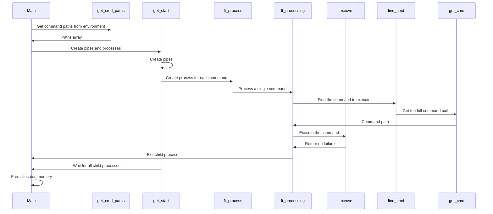
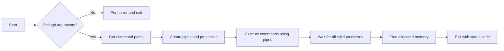

# PIPES_WITHOUT_REDIRECTION
**Description**
This project demonstrates a simple implementation of a pipe-based command execution without using redirection. It allows you to execute a series of commands where the output of one command is passed as the input to the next command.
**How it Works**
The main function of the program is to execute a series of commands specified as command-line arguments. The program creates a pipeline of processes, where each process corresponds to one of the commands. The processes are connected using pipes, allowing the output of one process to be used as the input for the next process.

**The key steps in the program's execution are:**

->Get Command Paths: The program retrieves the "PATH" environment variable and splits it into an array of directories to search for the commands.
->Create Pipes: The program creates a set of pipes, one for each pair of adjacent commands.
->Create Processes: The program creates a child process for each command and sets up the input and output file descriptors to use the appropriate pipes.
->Execute Commands: Each child process executes the corresponding command using the execve system call.
->Wait for Processes: The parent process waits for all the child processes to complete.
->Clean Up: The program frees the allocated memory and resources.

**Example Usage**
Suppose you have the following command-line arguments:
Copy```./a.out "ls -l" "wc -l"```
The program would execute the following steps:

**Create a pipe.**
Fork a child process to execute the ls -l command.

The child process's stdin is set to the read end of the pipe.
The child process's stdout is set to the write end of the pipe.


Fork a second child process to execute the wc -l command.

The child process's stdin is set to the read end of the pipe.
The child process's stdout is set to the default stdout.


The parent process waits for both child processes to complete.
The parent process cleans up the allocated resources.

The result of this pipeline would be the same as running the command ls -l | wc -l in the shell.
**Conclusion**
This project demonstrates a basic implementation of a pipe-based command execution without using redirection. It provides a foundation for understanding how processes can be chained together using pipes to create more complex command pipelines. The code can be further extended to handle more advanced features, such as error handling, argument parsing, and support for multiple input/output redirection.



And this will produce a flow chart:


